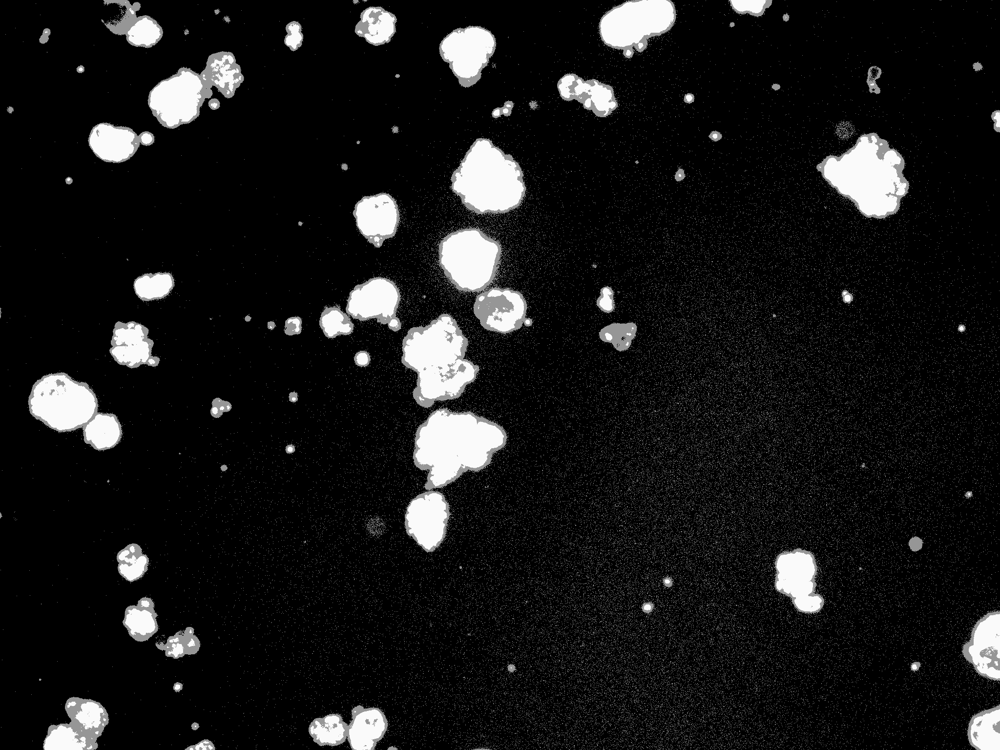
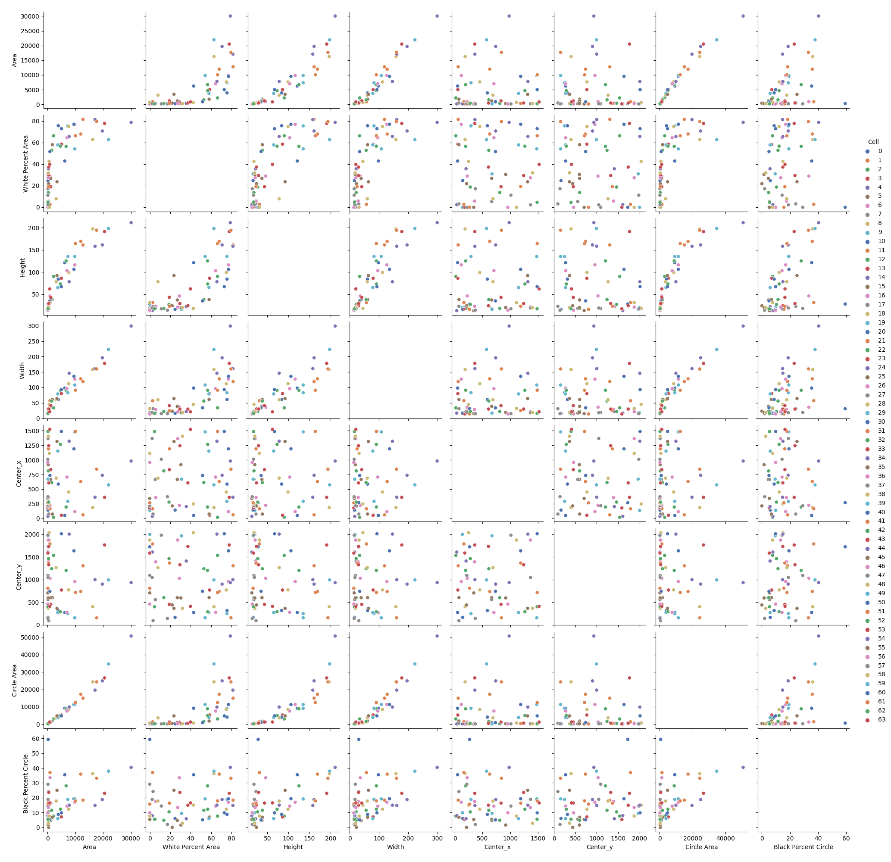
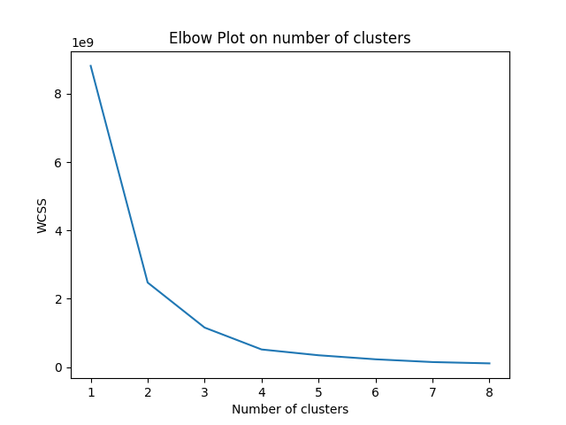
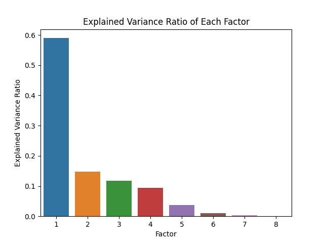

# Cell Images
Greg Howard & Srikanth Bonkuri

## Instructions

This project analyses cell images captured by DeNovix CellDrop cell counters. Once you have the relevant libraries and have cloned the repo, you can reproduce the results of the project with the Makefile.

#### Note: you will need several libraries, which you can install with pip 
```pip install opencv```
```pip install seaborn```
```pip install matplotlib```
```pip install numpy```
```pip install pandas```
```pip install sklearn```

### Reproducing the figures based on the dataset
First clone this repo.
```git clone https://github.com/ds5110/cell-images.git```
Then in the directory where you cloned this repo, call
```make```

You can also run the files in <strong><code>src</code></strong> individually:
#### Part 1
```python3 src/p1.py```
#### Part 2
```python3 src/p2.py```
#### Part 3
```python3 src/p3.py```
#### Part 3.5 (optional: used to produce the data that is already as a csv in /data/example.csv)
```python3 src/p3_5.py```
#### Part 4
```python3 src/p4.py```
#### Part 5
```python3 src/p5.py```
#### Part 6
```python3 src/p6.py```
Review <strong><code>figs</code></strong> and the file will have been overwritten by your runs. Feel free to delete the pre-existing figures in advance to truly validate. A simple way to do this is
```make clean```

## Part 1: Elementary Image File Analysis

Here we've proven we can read PNG files and show the count of pixels. All the PNGs we'll be working with have the following properties.
* pixel count: 3145728
* height: 1536
* width: 2048

## Part 2: Pixel Intensity Analysis


There are three types of images that are captured by DeNovix's CellDrop automated cell counters, prior to their algorithm producing a 'result' image. These images are brightfield, which involves passing light through the sample, and two kinds of fluorescent imaging, red and green. In the flourescent images, only the cells which have absorbed dyes will light up and appear bright in the image. In the green images, live and intact cells that (i.e. those that have absorbed acridine orange) light up. And, in the red images, dead cells (i.e. those that have absorbed propidium iodide) light up.

In this histogram of 256 bins - because there are 2^6 options for level of intensity in RGB - it is easy to see that there are different intensity levels prevailing in each of the image types. Specifically, there are more pixels of higher intensity in the brightfield image. And between the Red and the Green image it seems the Green image has brighter bright spots.

## Part 3: Image Gradient Reduction


This is a sample image of tumorspheres that have absorbed acridine orange captured in green flourescent light.
<br /><br /><br />


Here we have our gradient reduction of the image pixel intensities into buckets of white, black, and grey. This allows for easier analysis of cells bodies (and organelles), membranes (and plasma), and background, which enables easier analysis.
<br /><br />

## Part 4: Visualizing Feature Relationships



Here we've plotted all the features against one another on scatterplots, with the hue being set for each specific cell. While we have 64 cells, we only have 10 colors in our palette, so you may need some intuition to identify which cell you're looking at if you mean to track a single cell across the matrix of scatterplots. Even if you don't find the color useful, at least it's aesthetically pleasing.

There are a series of feature relationships that can be visualized across these plots. In the next part we explore one of these relationships in greater detail.

## Part 5: Cell Size by Fluorescence Analysis


White pixel count for this tumorsphere image is a measure of how much of a cell absorbed acridine orange dye. It is easy to see that there is a logarithmic relationship between the area of a cell and the percentage of it that is white. Notably, it's also easy to see that as a cell takes up more pixels, it is also more likely to have a larger proportion of white pixels. This is not surprising, nor is the bundle of scattered dots with 0% white and small total size, because the larger a cell and its organelles, the more fluorescent dye it will retain.

## Part 6: K-Means Clustering

Calculating within cluster sum of squares (WCSS), one can figure out the most informative number of clusters.

  'Within cluster sum of squares (WCSS) is the sum of squared distance between each point and its centroid in a cluster.'

  

In the Elbow method, we are actually varying the number of clusters (K) from 1 – 8, and for each value of K, we are calculating WCSS.


When we plotted the WCSS with the K values (see below), the plot looks like an Elbow. As the number of clusters increases, the WCSS value starts to decrease. WCSS value is largest when K = 1. And here we observed that WCSS is reducing substantially until k=4 and not very significantly thereafter.



Therefore, we used k-means to identify 4 clusters on two of our most interesting engineered features: White Percent Area and Black Percent Circle. The former is a measure of object fluorescence and the latter is a measure of object sphericity. We have plotted these against Area and Circle Area respectively. The Area is the area of the entire object (i.e. count of contiguous grey and white pixels that make up a cell or a clumped and touching neighborhood of cells). The Circle Area is the area of a circle produced on the center of the object with a diameter that is the average of the object’s width and height.


In both charts, it’s easy to see the relationship between clusters and the size of the object. Object size may be single most predictive feature for the variance across the population. It’s also interesting to note that cluster 3 (in moss green) holds only a single anomalous object, with a far larger pixel count than the rest. You can see in the image below that the object with the green plotted center point is the largest and most misshapen. And, it’s curious to see that there is a small cell with a very large percentage of black within its circle area. Likely, this is a slender oval, and perhaps it represents cellular material from a no longer intact cell. Due to the red cluster being so small, it's hard to identify which object this represents visually. It's possible we could color this particular object distinctly in the future to identify it. Before any such work, we want to review our work again with one of DeNovix's cell biologists, so we can focus our efforts where useful.


Interesting findings out there, the tiny cells been a cluster and each of them marked with Red. Next medium sized cells are marked with Yellow.
Similarly, the larger category cells marked with Blue. And finally the anomalous object that we're interpreting to finds it's cluster, has been the only single cell which made a cluster by its own. And it is the cell with largest size in the image and with high distortedness value in shape.

## Part 7: Principal Components Analysis



We can see here that among the principal components we have computed 3 of them will explain 95.7% of the variance among the cells and 4 components can cumulatively explain 98.3%. Once we consider 5 components or more, we can explain more than 99% of the variance.


For additional information on the relationsips between features we engineered in our dataframe and their principal components, here is the correlation matrix.

Dimensionality reduction is pretty meaningful in the context of our project, considering we may one day want our code to run rapidly on cell counter devices. In the more immediate future, we may also want to have subject matter experts tag cells for us in a way that we can use to train a deep learning model to count even non-spherical cells correctly. While this original test and train data may not be too large, future data sets from scientists we share this application with may be much larger. Therefore, we will continue to simultaneously engineer the most meaningful features we can and reduce the data frame size as much as possible.

## Acknowledgements

This work would not have been possible without the data and guidance provided by DeNovix, Inc. In particular we'd like to thank Aroshan Jayasinghe, Product Development Specialist, Vinsky Muthia, Application Scientist, and their entire product development team.

We'd also like to thank Professor Phil Bogden for teaching us the methods applied in this project and for providing the impetus to make this happen.

Lastly, we are grateful to the creators and contributors of Python, Pandas, Scikit-Learn, Matplotlib, Numpy, and OpenCV. To paraphrase Isaac Newton: if we have seen cells with greater insight, it is only by leveraging the work of giants.

## Note on deprecation warnings

Note: there is a bug that affects MacOS, which will throw an unecessary warning and is supposed to be corrected in the next major version. Until then, please do not mark off points if you experience this error as we have. Source for details of the error: https://github.com/matplotlib/matplotlib/issues/23921
