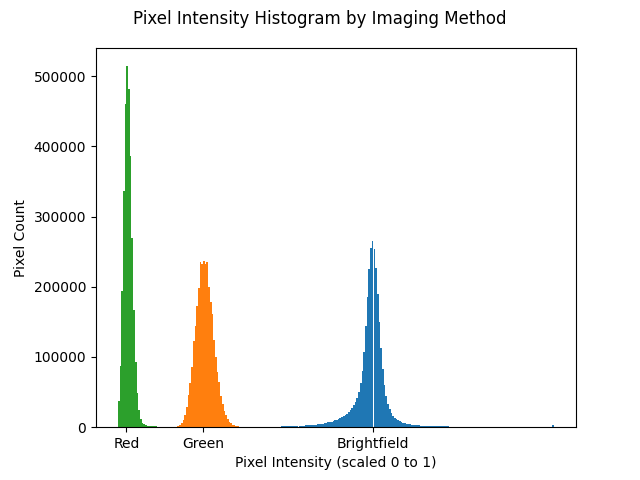
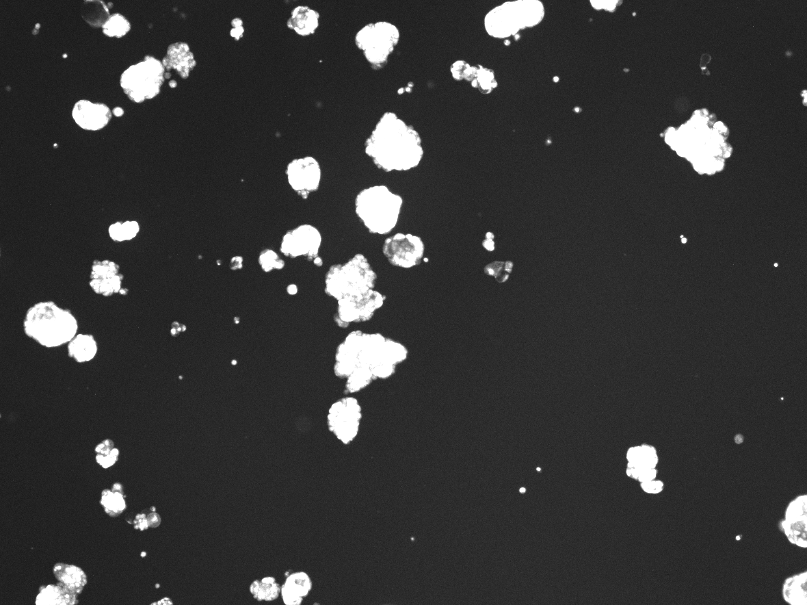

# Cell Images
Greg Howard & Srikanth Bonkuri

#### Note: you will need to download OpenCV for Python to complete Part2
```pip install opencv```

### Reproducing the figures based on the dataset
First clone this repo.
```git clone https://github.com/ds5110/cell-images.git```
Then in the directory where you cloned this repo, run the files in <strong><code>src</code></strong>.
#### Part 1
```python3 src/p1.py```
#### Part 2
```python3 src/p2.py```
#### Part 3
```python3 src/p3.py```
#### Part 3.5 (optional: used to produce the dataframe example, already as a csv in /data)
```python3 src/p3_5.py```
#### Part 4
```python3 src/p4.py```
Review <strong><code>figs</code></strong> and the file will have been overwritten by your runs. Feel free to delete the pre-existing figures in advance to truly validate.

## Part 1: Elementary Image Analysis

Here we've proven we can read PNG files and show the count of pixels. All the PNGs we'll be working with have the following properties.
* pixel count: 3145728
* height: 1536
* width: 2048

## Part 2: Pixel Intensity Analysis



There are three types of images that are captured by DeNovix's CellDrop automated cell counters, prior to their algorithm producing a 'result' image. These images are brightfield, which involves passing light through the sample, and two kinds of fluorescent imaging, red and green. In the flourescent images, only the cells which have absorbed dyes will light up and appear bright in the image. In the green images, live and intact cells that (i.e. those that have absorbed acridine orange) light up. And, in the red images, dead cells (i.e. those that have absorbed propidium iodide) light up.

In this histogram of 256 bins - because there are 2^6 options for level of intensity in RGB - it is easy to see that there are different intensity levels prevailing in each of the image types. Specifically, there are more pixels of higher intensity in the brightfield image. And between the Red and the Green image it seems the Green image has brighter bright spots.

Note: there is a bug that affects MacOS, which will throw an unecessary warning and is supposed to be corrected in the next major version. Until then, please do not mark off points if you experience this error as I have: https://github.com/matplotlib/matplotlib/issues/23921

## Part 3: Greyscale Image Reduction


This is a sample image of hepatocytes that have absorbed acridine orange, glowing green in flourescent light.


Here we have our greyscale reduction of the image, which we produce for easier analysis.

## Part 4: Analyses


It is easy to see that there is a logarithmic relationship between the area of a cell and the percentage of it that is white. Notably, it's also easy to see that as a cell takes up more pixels, it is also more likely to have a larger proportion of white pixels. This is not surprising, nor is the bundle of scattered dots with 0% white and small total size, because the larger a cell, the more flourescent dye it will hold onto.

## Operational feasibility:

We have held multiple meetings now with the DeNovix team: one with Aroshan Jayasinghe, the Product Development Specialist responsible for the algorithm in CellDrop automated cell counters, and one with Vinsky Muthia, an Application Scientist who helped explain (a) the nature of the cells in the images, and (b) the applications of interest to customers downstream from DeNovix. They have provided many additional images in their corporate Shared Drive, and we can access and request additional files as we may need to. The team is very willing to continue helping us learn, as we develop code and analyses around their images in the coming weeks.

## Areas of research interest:

We are working with hepatocytes (i.e. liver cells) in this test run. These cells can sometimes be identified by the CellDrop algorithm to contain multiple cells in a single cell. This is due to there being lots of organelles in hepatocytes. Perhaps we can more accurately count the hepatocytes.

Other cell lines that are of particular interest include isolated nucleii, as these are particularly relevant to genomic sequencing, and tumospheres, because they take odd shapes where again the stakeholder's algorithm doesn't always count correctly.

The statistical learning we believe could be helpul, once we've cracked some of the computer vision, is clustering methods. We've learned from the stakeholder that identifying non-spherical objects is a really hard challenge. This is in no small part, because the images captured by the cell counters are 2D projections of a 3D volume.

Currently, dye-absorption and size are the primary features used to distinguish between cells of interest and debris. If we can cluster based on shape that will provide a foundation for improvement.
