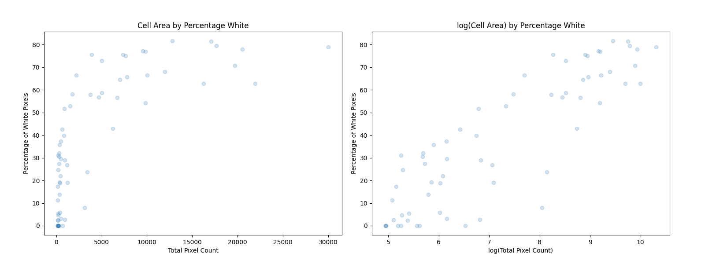

# Cell Images
Greg Howard & Srikanth Bonkuri

## Background:
For this final project we partnered with DeNovix, a biomedical research company that manufactures and sells automated cell counters under the brand name CellDrop. Using a dataset of CellDrop images, we set out to create our own cell enumeration algorithm from first principles. More specifically, we aimed to solve an issue the DeNovix Product Development Team described where their conventional algorithm struggles in counting non-spherical objects.

Knowing DeNovix has yet to pair statistical learning techniques with their computer vision, we've been hopeful to employ the lessons of this course to make inroads towards a solution. By first engaging in exploratary data analysis with unsupervised learning approaches that included K-means clustering and Principal Component Analysis (PCA), we hoped to establish the foundation for the development of valuable intellectual property.

Over the course of the semester, we've learned that one of the many cell counters on the market, the Countess 3 by Thermo Fisher Scientific, strenghtens their automated analysis with the aid of artificial intelligence. They use the tagline: "automated cell counters that think like a cell biologist." We've also learned about a startup called Rewire Neuro whose Pipsqueak Pro software automates analyses of cell images. Given that both of these inroads towards computationally enhanced cellular learning are in their early stages, we've envisioned that we too are taking baby steps towards a commercially useful implementation of machine learning within cytometry.

#### Green fluoroscent image of hepatocytes:

#### Brightfield image of blood sample:

## Part 1: Elementary Image File Analysis

For a quick start, our first step was to prove we can read PNG files and show the count of pixels. All the PNGs we've be worked with share the following properties:
* pixel count: 3,145,728
* height: 1,536
* width: 2,048

## Part 2: Pixel Intensity Analysis

There are three types of images that are captured by DeNovix's CellDrop cell counters, prior to their algorithm producing a 'result' image. These images are brightfield, which involves passing light through the sample, and two kinds of fluorescent imaging, red and green. In the flourescent images, only the cells which have absorbed dyes will light up and appear bright in the image. In the green images, live and intact cells (i.e. those that have absorbed acridine orange) light up. And, in the red images, dead cells (i.e. those that have absorbed propidium iodide) light up.

In this histogram of 256 bins - because there are 2^6 options for level of intensity in RGB - it is easy to see that there are different intensity levels prevailing in each of the image types. Specifically, there are more pixels of higher intensity in the brightfield image. And between the Red and the Green images it seems the Green image has brighter bright spots.

## Part 3: Image Gradient Reduction

This is a sample image of tumorspheres that have absorbed acridine orange captured in green flourescent light.
   

Here we have our gradient reduction of the image pixel intensities into buckets of white, black, and grey. This allows for easier analysis of cells bodies (and organelles), membranes (and plasma), and background, which enables easier analysis.
  

For the remainder of this analysis, we'll discuss findings around this single image. Within it we count 64 cells (objects with greater than 128 contiguous black and grey pixels), and these objects with 8 features we engineered for each of them comprise our dataset.

The way we identified cells involved walking through the pixels of the above image and checking the intensity levels of each. We were inspired by depth first search approaches to counting islands. There are several examples of this online, and we were inspired by Katie's in particular (https://dev.to/stuttskl/solving-number-of-islands-using-a-depth-first-search-6f3). Ultimately, however, we developed our own breadth first search and did so for two reasons: (1) it was easier to visualize, which is critical in image based domains, and (2) this way we would be developing our own intellectual property from scratch, rather than mimicking what we had already encountered.

We could have repurposed someone else's BFS code, but for reason (2) above we didn't. This meant we spent a substantial amount of time towards the start of the project engaging in feature engineering and debugging.

The features we've engineered for each cell are:
* Area (pixel count)
* White Percent Area (white pixels as a percentage of total pixels)
* Height
* Width
* Center x Coordinate
* Center y Coordinate
* Circle Area (math.pi * radius^2, where radius is (Height + Width)/4)
* Black Percent Circle (black pixels within circle radius as a percentage of the circle area)

## Part 4: Visualizing Feature Relationships

Here we've plotted all the features against one another on scatterplots, with the hue being set for each specific cell. While we have 64 cells, we only have 10 colors in our palette, so you may need some intuition to identify which cell you're looking at if you mean to track a single cell across the matrix of scatterplots. Even if you don't find the color useful, at least it's aesthetically pleasing.

There are a series of feature relationships that can be visualized across these plots. In the next part we explore one of these relationships in greater detail.

## Part 5: Cell Size by Fluorescence Analysis

White pixel count for this tumorsphere image is a measure of how much of a cell absorbed acridine orange dye. It is easy to see that there is a logarithmic relationship between the area of a cell and the percentage of it that is white. Notably, it's also easy to see that as a cell takes up more pixels, it is also more likely to have a larger proportion of white pixels. This is not surprising, nor is the bundle of scattered dots with 0% white and small total size, because the larger a cell and its organelles, the more fluorescent dye it will retain.

## Part 6: K-Means Clustering

Calculating within cluster sum of squares (WCSS), one can figure out the most informative number of clusters.

  'Within cluster sum of squares(WCSS) mean the sum of squared distance between each point and it's centroid in a cluster.'

In the Elbow method, we are actually varying the number of clusters (K) from 1 – 8, and for each value of K, we are calculating WCSS. When we plotted the WCSS with the K values, the plot looks like an Elbow. As the number of clusters increases, the WCSS value starts to decrease. WCSS value is largest when K = 1.
And here we observed that WCSS is reducing substantially until k=4 and not very significantly thereafter.

Therefore, we used k-means to identify 4 clusters on two of our most interesting engineered features: White Percent Area and Black Percent Circle. The former is a measure of object fluorescence and the latter is a measure of object sphericity. We have plotted these against Area and Circle Area respectively. The Area is the area of the entire object (i.e. count of contiguous grey and white pixels that make up a cell or a clumped and touching neighborhood of cells). The Circle Area is the area of a circle produced on the center of the object with a diameter that is the average of the object’s width and height.

In both charts, it’s easy to see the relationship between clusters and the size of the object. Object size may be single most predictive feature for the variance across the population. It’s also interesting to note that cluster 3 (in moss green) holds only a single anomalous object, with a far larger pixel count than the rest. Perhaps this object is a clump of multiple overlapping cells. And, it’s curious to see that there is a small cell with a very large percentage of black within its circle area. Likely, this is a slender oval, and perhaps it represents cellular material from a no longer intact cell. Prior to our final submission, we may seek to recreate images with the clusters identified visually for more intutive analyses and review with a cell biologist.

## Part 7: Principal Components Analysis

We can see here that among the principal components we have computed 3 of them will explain 95.7% of the variance among the cells and 4 components can cumulatively explain 98.3%. Once we consider 5 components or more, we can explain more than 99% of the variance.

For additional information on the relationsips between features we engineered in our dataframe and their principal components, here is the correlation matrix.

Dimensionality reduction is pretty meaningful in the context of our project, considering we may one day want our code to run rapidly on cell counter devices. In the more immediate future, we may also want to have subject matter experts tag cells for us in a way that we can use to train a deep learning model to count even non-spherical cells correctly. While this original test and train data may not be too large, future data sets from scientists we share this application with may be much larger. Therefore, we will continue to simultaneously engineer the most meaningful features we can and reduce the data frame size as much as possible.

## Acknowledgements

This work would not have been possible without the data and guidance provided by DeNovix, Inc. In particular we'd like to thank Aroshan Jayasinghe, Product Development Specialist, Vinsky Muthia, Application Scientist, and their entire product development team.

We'd also like to thank Professor Phil Bogden for teaching us the methods applied in this project and for providing the impetus to make this happen.

Lastly, we are grateful to the creators and contributors of Python, Pandas, Scikit-Learn, Matplotlib, Numpy, and OpenCV. To paraphrase Isaac Newton: if we have seen cells with greater insight, it is only by leveraging the work of giant computer scientists.
